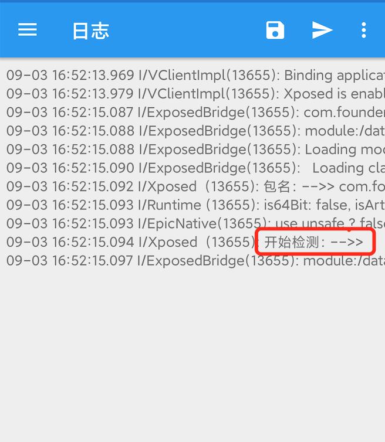
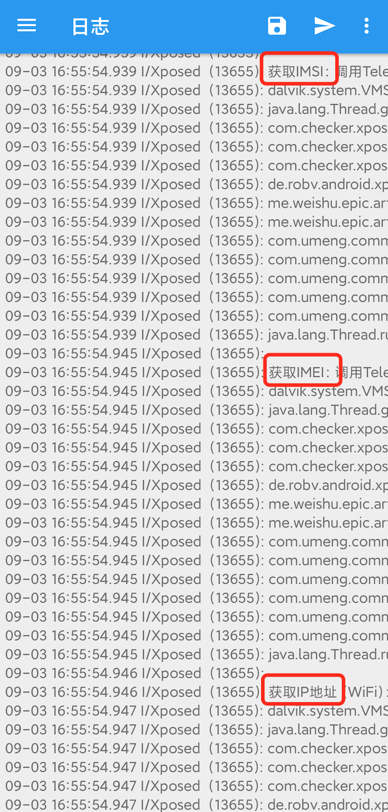

[TOC]

## 一、背景

目前，大量的移动app在使用过程中，涉及个人隐私信息和敏感信息。在个人信息处理、共享、转让、公开披露过程中，管理流程和技术手段不规范造成个人信息泄露的安全事件层出不穷。

中央网信办、工信部、公安部、市场监管总局指导成立App违法违规收集使用个人信息专项治理工作组（App专项治理工作组），组织开展App收集使用个人信息评估工作。对于未按规定收集用户隐私信息和敏感信息的app，可能会被要求整改或下架。

在我们的app发布时，也曾几次遇到发布到各应用市场时，由于未遵守敏感信息规定被打回的情况，导致发布推迟，涉及到的用户敏感信息主要有：<u>IP地址、MAC地址、IMEI、IMSI、应用安装列表</u>等。

为了达到合法合规使用个人信息的要求，我们的整改目标是：

1）尽量减少对用户隐私信息及敏感信息的使用和收集；

2）对于无法规避、需要获取的用户信息，需要在app隐私协议中对用户声明；

3）未经用户授权，禁止对所有敏感信息的获取。

对应的处理方案为：

1）排查app工程代码，停止收集非必要的用户信息；

2）排查必要的用户信息，并在隐私协议中一一声明；

3）排查必要用户信息的收集时机，在用户授权同意隐私协议之前，禁止调用。

以上1和2由各app自己的业务决定，我们主要关注第3项的实现。

## 二、方案 

对于以上第3点，整理我们自己的app中的信息获取可能比较好执行。然而，在我们的app中，通常会集成多个甚至几十上百个其他的库，这些库将在什么时机获取哪些敏感信息，通常我们无法控制，也无法感知。大部分app发布时被告知未遵守敏感信息规定被打回的情况都是源自于此。

对于大型app，一个一个排查第三方库是否合规不太现实。不过我们关注的用户敏感信息是有限的，用来获取这些数据的系统Api也是确定的，那么最好是直接hook到获取敏感信息的对应的系统Api，一旦有任何代码在隐私协议前调用了该系统Api，我们就能知道是哪里违规了。

经过调研，要Hook到系统Api，AspectJ等方式都是无法实现的，而Xposed框架可以实现对所有系统Api调用的拦截，使我们可以实现在不修改我们的目标app的前提下，去检测它的系统Api调用情况。

Xposed 是一个 Android 平台上的动态劫持框架，通过替换手机上的孵化器 zygote 进程为 Xposed 自带的  zygote，使其在启动过程中加载 XposedBridge.jar，模块开发者可以通过 jar 提供的 API 来实现对所有的  Function 的劫持，在原 Function 执行的前后加上自定义代码（[Xposed原理](https://bbs.pediy.com/thread-223713.htm)）。

现在通过使用Xposed技术来hook系统api调用的方式，检测获取隐私信息api的调用，目前已纳入检测范围的有以下Api：

1. 获取MAC地址：WifiInfo.getMacAddress()
2. 获取MAC地址：NetworkInterface.getHardwareAddress()
3. 获取IMEI/deviceId：TelephonyManager.getDeviceId()
4. 获取IMSI：TelephonyManager.getSubscriberId()
5. 获取IP地址：WiFi：WifiInfo.getIpAddress()，Mobile：NetworkInterface.getInetAddresses()
6. 获取安装列表：PackageManager.getInstalledPackages(int)
7. 获取Android ID：Secure.getString(context.getContentResolver(), Secure.ANDROID_ID)
8. 获取设备硬件序列号：Build.getSerial()
9. 获取SIM卡序列号：TelephonyManager.getSimSerialNumber()
10. 获取SD卡挂载状态：Environment.getExternalStorageState()
11. 获取正在运行的所有应用程序进程：ActivityManager.getRunningAppProcesses()

## 三、实现

我们的无侵入式、获取敏感信息检测Hook模块实现如下：

1、在新建的检测app工程build.gralde中引入Xposed库：

```
compileOnly 'de.robv.android.xposed:api:82'
compileOnly 'de.robv.android.xposed:api:82:sources'
```

2、实现Xposed自定义模块Hook类，添加检测代码：

1）可以修改HOOK_PACKAGE_NAME常量内容，及打开相关注释代码，来指定过滤的目标app包名，以免hook到其他app产生干扰。

2）rewriteMetaData()接口可以修改获取到的MetaData内容，若目标app中有签名校验逻辑，可能导致在VirtualXposed中由于签名校验不通过无法打开，那么我们的检测模块是否真的可以做到无侵入，就看目标app是否有签名校验逻辑、以及如果有 那我们是否可以屏蔽它的签名校验逻辑了。

如果是检测我们自己的app，由于我们能知道它是否有签名校验、以及校验实现逻辑，要做到这个还是比较简单的，比如：已知虚拟环境中获取到的签名信息为空，如果签名校验逻辑是判断从packageInfo.signingInfo中获取的签名信息与从MetaData中取出来的值是否一致，那么就要通过Hook来修改获取MetaData时返回的对应字段也为空，就可以“骗过”签名校验逻辑了。

```java
public class XposedHook implements IXposedHookLoadPackage {
    // 待检测的包名
    private static final String HOOK_PACKAGE_NAME = "com.sina.weibo";
    // 是否打印调用堆栈
    private static final boolean PRINT_STACK_TRACE = true;

    @RequiresApi(api = Build.VERSION_CODES.P)
    public void handleLoadPackage(XC_LoadPackage.LoadPackageParam lpparam) {
        XposedBridge.log("包名：-->> " + lpparam.packageName);

        /*过滤hook的包名*/
//        if (!HOOK_PACKAGE_NAME.equals(lpparam.packageName)) {
//            return;
//        }

        // 获取签名信息
        // getSigningInfo(lpparam);

        // 可用于屏蔽签名校验
        rewriteMetaData(lpparam, "AppSignature", "You Are Hooked");

        // 检查敏感信息获取
        checkPrivateInfoApis(lpparam);
    }

    /**
     * 获取签名
     *
     * @param lpparam
     */
    @RequiresApi(api = Build.VERSION_CODES.P)
    private void getSigningInfo(XC_LoadPackage.LoadPackageParam lpparam) {
        // 获取签名信息：抽象方法需要找到其实现类来hook
        XposedHelpers.findAndHookMethod(
                "android.app.ApplicationPackageManager",
                lpparam.classLoader,
                "getPackageInfo",
                String.class,
                int.class,
                new XC_MethodHook() {
                    @Override
                    protected void afterHookedMethod(MethodHookParam param) throws Throwable {
                        XposedBridge.log("\n获取打包信息：-->> packageInfo = " + param.getResult());
                        PackageInfo packageInfo = (PackageInfo) param.getResult();
                        XposedBridge.log("\n获取签名信息：-->> packageInfo.signingInfo = " + packageInfo.signingInfo);
                        super.afterHookedMethod(param);
                    }
                });
    }

    /**
     * 重写Meta数据
     *
     * @param lpparam
     * @param key
     * @param value
     */
    private void rewriteMetaData(XC_LoadPackage.LoadPackageParam lpparam, String key, String value) {
        XposedHelpers.findAndHookMethod(
                "android.app.ApplicationPackageManager",
                lpparam.classLoader,
                "getApplicationInfo",
                String.class,
                int.class,
                new XC_MethodHook() {
                    @Override
                    protected void afterHookedMethod(MethodHookParam param) throws Throwable {
                        ApplicationInfo applicationInfo = (ApplicationInfo) param.getResult();
//                        XposedBridge.log("\n获取Meta数据：-->> metaData = " + applicationInfo.metaData);
//                        XposedBridge.log("\n获取Meta数据：-->> " + key + " = " + applicationInfo.metaData.get(key));
                        // 修改数据
                        applicationInfo.metaData.putString(key, value);
//                        XposedBridge.log("\n修改Meta数据：-->> " + key + " = " + value);
                    }
                });
    }

    private void checkPrivateInfoApis(XC_LoadPackage.LoadPackageParam lpparam) {
        XposedBridge.log("开始检测：-->> ");
        // MAC地址
        XposedHelpers.findAndHookMethod(
                android.net.wifi.WifiInfo.class.getName(),
                lpparam.classLoader,
                "getMacAddress",
                new XC_MethodHook() {
                    @Override
                    protected void beforeHookedMethod(MethodHookParam param) throws Throwable {
                        super.beforeHookedMethod(param);
                        XposedBridge.log("\n获取MAC地址：调用WifiInfo.getMacAddress()");
                        if (PRINT_STACK_TRACE) {
                            XposedBridge.log(getMethodStack());
                        }
                    }
                }
        );

        // MAC地址
        XposedHelpers.findAndHookMethod(
                java.net.NetworkInterface.class.getName(),
                lpparam.classLoader,
                "getHardwareAddress",
                new XC_MethodHook() {
                    @Override
                    protected void beforeHookedMethod(MethodHookParam param) throws Throwable {
                        super.beforeHookedMethod(param);
                        XposedBridge.log("\n获取MAC地址：调用NetworkInterface.getHardwareAddress()");
                        if (PRINT_STACK_TRACE) {
                            XposedBridge.log(getMethodStack());
                        }
                    }
                }
        );

        // IP地址：WiFi
        XposedHelpers.findAndHookMethod(
                android.net.wifi.WifiInfo.class.getName(),
                lpparam.classLoader,
                "getIpAddress",
                new XC_MethodHook() {
                    @Override
                    protected void beforeHookedMethod(MethodHookParam param) throws Throwable {
                        super.beforeHookedMethod(param);
                        XposedBridge.log("\n获取IP地址（WiFi）：调用WifiInfo.getIpAddress()");
                        if (PRINT_STACK_TRACE) {
                            XposedBridge.log(getMethodStack());
                        }
                    }
                });

        // IP地址：Mobile
        XposedHelpers.findAndHookMethod(
                java.net.NetworkInterface.class.getName(),
                lpparam.classLoader,
                "getInetAddresses",
                new XC_MethodHook() {
                    @Override
                    protected void beforeHookedMethod(MethodHookParam param) throws Throwable {
                        super.beforeHookedMethod(param);
                        XposedBridge.log("\n获取IP地址（Mobile）：调用NetworkInterface.getInetAddresses()");
                        if (PRINT_STACK_TRACE) {
                            XposedBridge.log(getMethodStack());
                        }
                    }
                });

        // IMEI
        XposedHelpers.findAndHookMethod(
                android.telephony.TelephonyManager.class.getName(),
                lpparam.classLoader,
                "getDeviceId",
                new XC_MethodHook() {
                    protected void beforeHookedMethod(MethodHookParam param) throws Throwable {
                        super.beforeHookedMethod(param);
                        XposedBridge.log("\n获取IMEI：调用TelephonyManager.getDeviceId()");
                        if (PRINT_STACK_TRACE) {
                            XposedBridge.log(getMethodStack());
                        }
                    }
                });

        // IMSI
        XposedHelpers.findAndHookMethod(
                android.telephony.TelephonyManager.class.getName(),
                lpparam.classLoader,
                "getSubscriberId",
                new XC_MethodHook() {
                    protected void beforeHookedMethod(MethodHookParam param) throws Throwable {
                        super.beforeHookedMethod(param);
                        XposedBridge.log("\n获取IMSI：调用TelephonyManager.getSubscriberId()");
                        if (PRINT_STACK_TRACE) {
                            XposedBridge.log(getMethodStack());
                        }
                    }
                });

        // 获取安装列表：抽象方法需要找到其实现类来hook
        XposedHelpers.findAndHookMethod(
                "android.app.ApplicationPackageManager",
                lpparam.classLoader,
                "getInstalledPackages",
                int.class,
                new XC_MethodHook() {
                    protected void beforeHookedMethod(MethodHookParam param) throws Throwable {
                        super.beforeHookedMethod(param);
                        XposedBridge.log("\n获取安装列表：调用PackageManager.getInstalledPackages(int)");
                        if (PRINT_STACK_TRACE) {
                            XposedBridge.log(getMethodStack());
                        }
                    }
                });
    }

    private String getMethodStack() {
        StackTraceElement[] stackTraceElements = Thread.currentThread().getStackTrace();

        StringBuilder stringBuilder = new StringBuilder();

        for (StackTraceElement temp : stackTraceElements) {
            stringBuilder.append(temp.toString() + "\n");
        }

        return stringBuilder.toString();
    }
}
```

3）注册Xposed自定义模块：

在src/main/assets下新建`xposed_init`文件，在这个文件里添加Hook类路径：

```
com.checker.xposed_hook.XposedHook
```

在`AndroidManifest.xml`中添加：

```xml
<!--Xposed模块-->
<meta-data
    android:name="xposedmodule"
    android:value="true" />
<!--模块说明，一般为模块的功能描述-->
<meta-data
    android:name="xposeddescription"
    android:value="@string/info" />
<!--模块兼容版本-->
<meta-data
    android:name="xposedminversion"
    android:value="54" />
```

## 四、使用

1）编译项目，安装Xposed模块到VirtualXposed，并确认已勾选并生效（可查看[VirtualXposed入门教程](./Xposed虚拟环境VirtualXposed入门教程.md)）。

2）将需要检测的目标app复制/安装到VirtualXposed，注意不要使用加固后的app，可能会无法打开。

3）运行目标app，并观察分析XposedInstaller中的日志：

检测开始：



检测到敏感信息Api调用：



4）若在同意隐私协议前，只有“开始检测”日志，而无敏感信息Api调用日志，就说明目标App已经合规了；若不合规，则需要查看其Api调用堆栈，将相关调用挪到隐私协议之后。保存下来的日志文件一般在“/sdcard/Android/data/de.robv.android.xposed.installer/files”目录下。

## 参考文档

[Android获取敏感信息整改---基于Xposed的方法检测](https://blog.csdn.net/DeMonliuhui/article/details/116191106)

[Android 违规获取用户隐私(获取MAC地址)整改](https://blog.csdn.net/EthanCo/article/details/111544333)

[Xposed模块开发入门](https://www.52pojie.cn/thread-688466-1-1.html)

