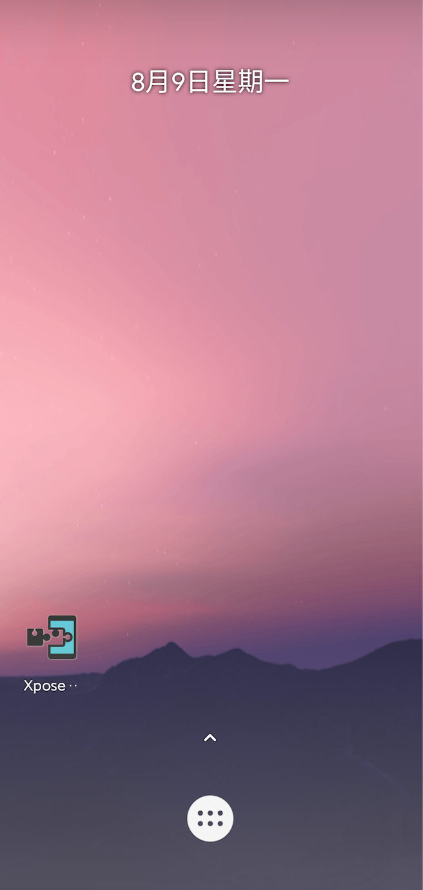
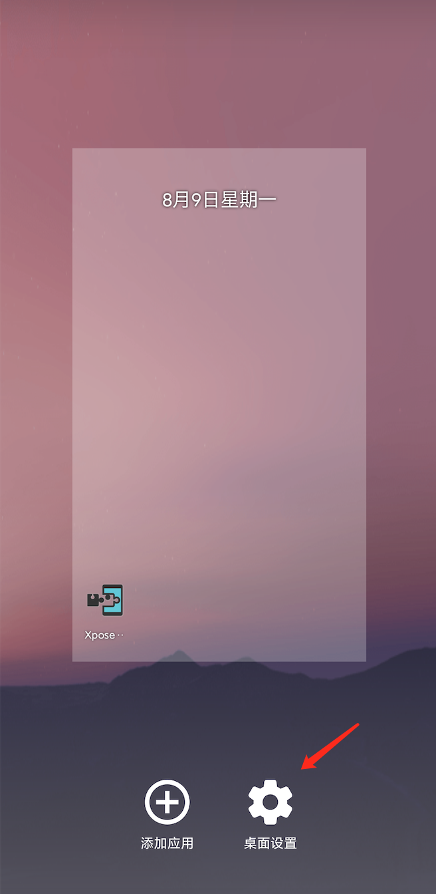
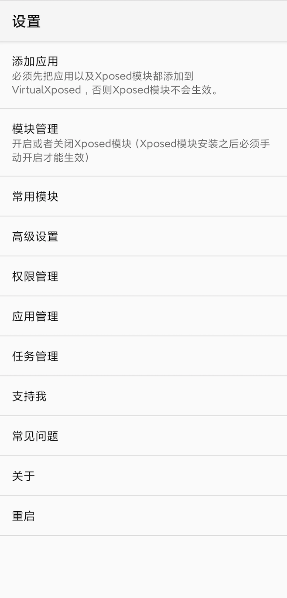
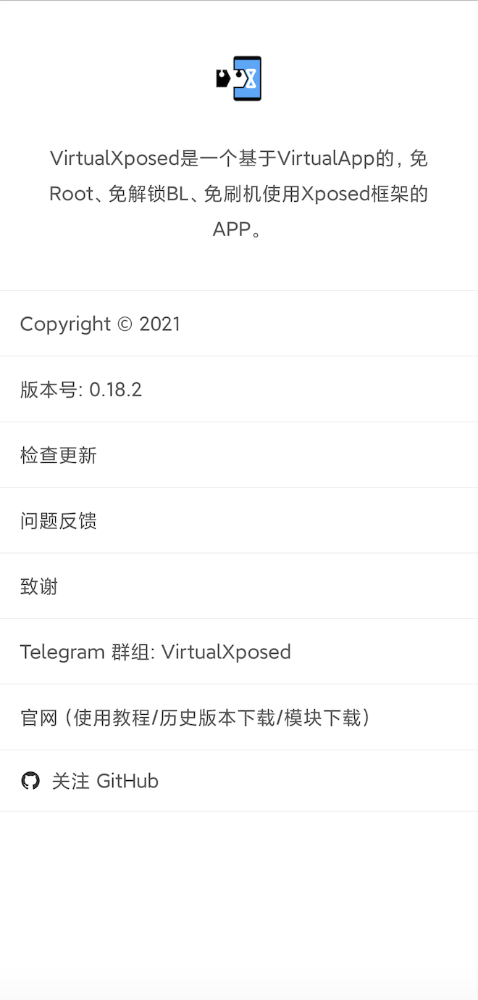
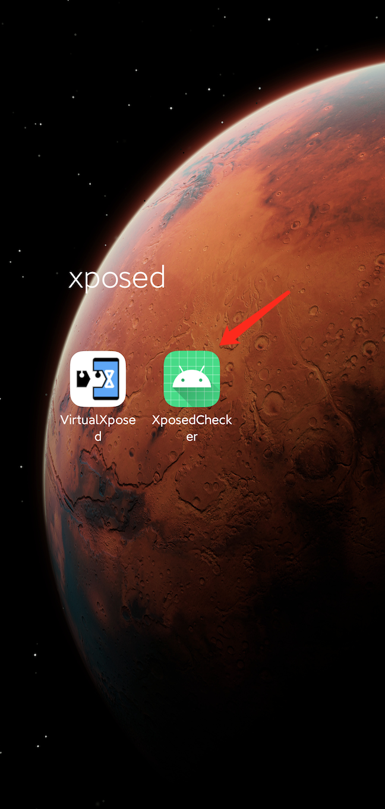
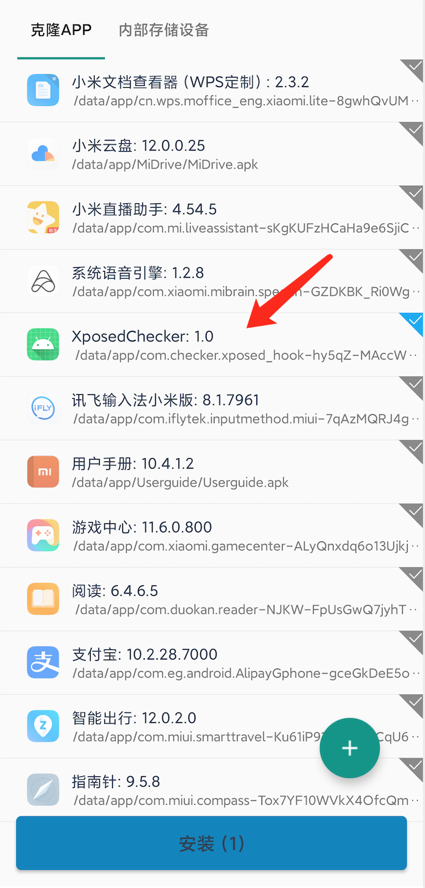
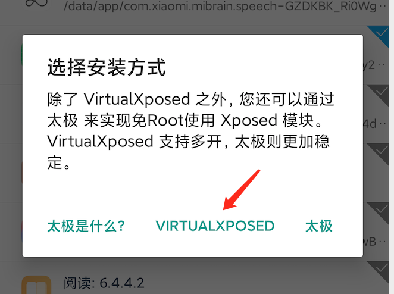
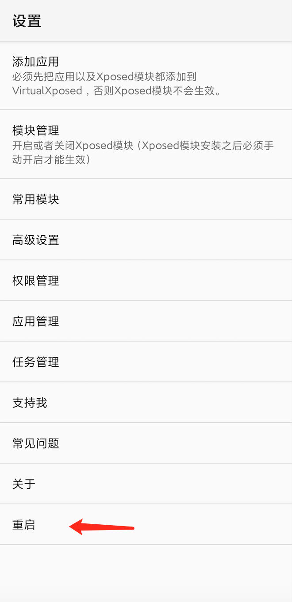
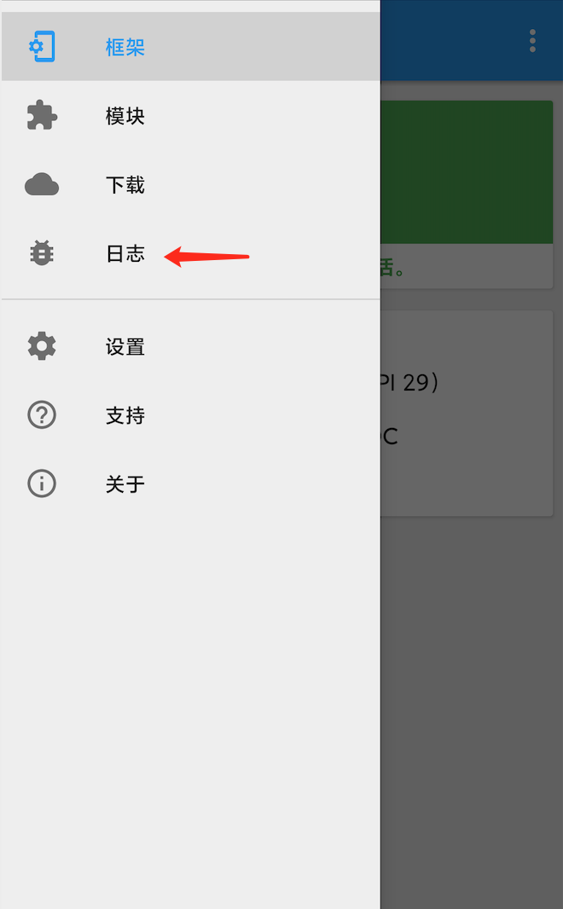
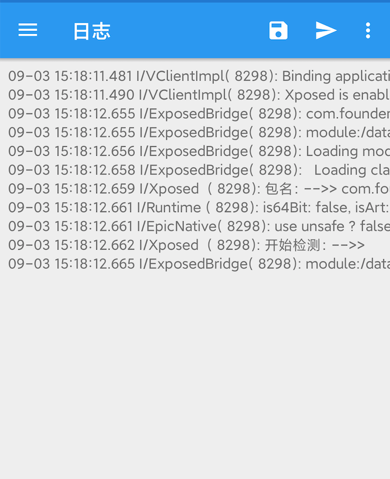

# Xposed：VirtualXposed入门教程

> Xposed 是一个 Android 平台上的动态劫持框架，通过替换手机上的孵化器 zygote 进程为 Xposed 自带的  zygote，使其在启动过程中加载 XposedBridge.jar，模块开发者可以通过 jar 提供的 API 来实现对所有的  Function 的劫持，在原 Function 执行的前后加上自定义代码。
>
> 但是，这套框架需要设备解锁了[Bootloader](https://zh.wikipedia.org/wiki/Bootloader)方可安装使用[[1\]](https://zh.wikipedia.org/wiki/Xposed_(框架)#cite_note-1)（[root](https://zh.wikipedia.org/wiki/Root_(Android))为解锁Bootloader的充分不必要条件，而xposed安装仅需通过[TWRP](https://zh.wikipedia.org/wiki/TWRP)等第三方[Recovery](https://zh.wikipedia.org/w/index.php?title=Android_System_Recovery&action=edit&redlink=1)[卡刷](https://zh.wikipedia.org/wiki/刷机)安装包而不需要设备拥有完整的root权限），需要承担手机变砖和系统安全方面的风险，上手难度较高。而VirtualXposed的出现，则使Xposed的使用变得非常的简单，无需root、不需要解锁Bootloader、不需要刷机。

下面来介绍下如何使用VirtualXposed。

[TOC]

## 1、准备虚拟环境

安装VirtualXposed.apk（[V0.18.2下载链接](https://github.com/android-hacker/VirtualXposed/releases/download/0.18.2/VirtualXposed_0.18.2.apk)）

安装好后，打开VirtualXposed，会显示虚拟环境桌面：

往上滑可以查看已安装在虚拟环境中的XposedInstaller和其他app，在桌面空白处长按，可以进入添加应用或设置页面：

点击关于，可以查看VirtualXposed版本：

## 2、安装Xposed Hook模块

准备好Hook模块，我们自己开发的Xposed Hook模块一般是以app的形式包装，将这个app安装到VirtualXposed有两种方式：

1）先正常安装这个带Hook的app到真实环境，再在VirtualXposed中通过添加应用的方式，复制到虚拟环境；

2）直接在VirtualXposed中通过添加应用、从手机存储中选择apk文件，安装app到虚拟环境。

第1种方式更为直接，下面我们就介绍这种方式：

首先安装这个带Hook的app到真实环境：

打开VirtualXposed，克隆这个带Hook的app到虚拟环境：虚拟桌面-长按-添加应用-勾选应用-安装

弹框中选择VirtualXposed：

等待安装，首次安装完成后，可以先不用打开，选择“完成”即可（因为首次安装后，xposed模块尚未加载生效）：

## 3、激活Xposed Hook模块

安装完成后，回到桌面，开始激活xposed模块：桌面-设置-模块管理 （或 在桌面-XposedInstaller-左上角菜单-模块）：

勾选模块：

检查模块是否为勾选状态，若不是，勾选模块。勾选模块后，会提示要重启虚拟环境才能生效，回到设置页面重启（与真实设备一样，在虚拟环境中，通过返回或在多任务界面中切换的方式可以回到设置页面）：

好，现在我们的Xposed模块就已经生效了，可以在XposedInstaller中观察xposed日志：

在日志页面点击右上角保存按钮，可以把日志输出到本地文件，e.g. /storage/emulated/0/Android/data/de.robv.android.xposed.installer/files/xposed_error_20210809_144435.log

参考文献：

[1] [关于 Android 7.1 的 Xposed，你想知道的都在这](https://sspai.com/post/40121#!)

[2] [Andriod Xposed和VirtualXposed](https://www.cnblogs.com/zhucq/p/12079879.html)

[3] [不需要 Root，也能用上强大的 Xposed 框架：VirtualXposed](https://sspai.com/post/44447)